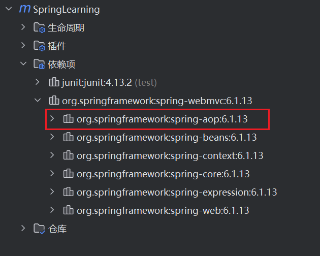

# 使用注解开发

在spring4之后，想要使用注解形式，必须得要引入aop的包




在配置文件当中，还得要引入一个context约束


```xml
<?xml version="1.0" encoding="UTF-8"?>
<beans xmlns="http://www.springframework.org/schema/beans"
      xmlns:xsi="http://www.w3.org/2001/XMLSchema-instance"
      xmlns:context="http://www.springframework.org/schema/context"
      xsi:schemaLocation="http://www.springframework.org/schema/beans
       http://www.springframework.org/schema/beans/spring-beans.xsd
       http://www.springframework.org/schema/context
       http://www.springframework.org/schema/context/spring-context.xsd">

</beans>

```

## Bean的实现
我们之前都是使用 bean 的标签进行bean注入，但是实际开发中，我们一般都会使用注解！

### 1.配置扫描哪些包下的注解

```xml
<!--指定注解扫描包-->
<context:component-scan base-package="com.kuang.pojo"/>

```

### 2.在指定包下编写类，增加注解

```xml
@Component("user")
// 相当于配置文件中 <bean id="user" class="当前注解的类"/>
public class User {
   public String name = "秦疆";
}

```

### 3.测试

```xml
@Test
public void test(){
   ApplicationContext applicationContext =
       new ClassPathXmlApplicationContext("beans.xml");
   User user = (User) applicationContext.getBean("user");
   System.out.println(user.name);
}

```

## 属性注入
使用注解注入属性

### 1.可以不用提供set方法，直接在直接名上添加@value(“值”)

```java
@Component("user")
// 相当于配置文件中 <bean id="user" class="当前注解的类"/>
public class User {
   @Value("秦疆")
   // 相当于配置文件中 <property name="name" value="秦疆"/>
   public String name;
}

```


### 2.如果提供了set方法，在set方法上添加@value(“值”);

```java

@Component("user")
public class User {

   public String name;

   @Value("秦疆")
   public void setName(String name) {
       this.name = name;
  }
}
```

## example:test17